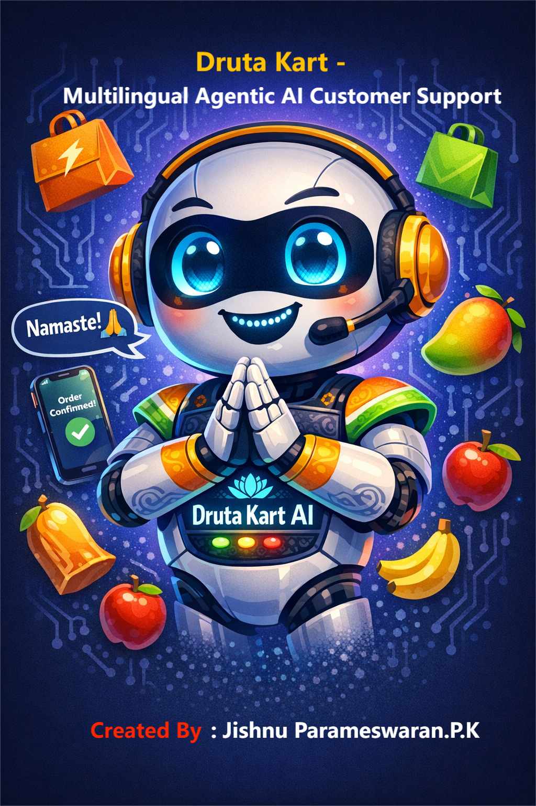
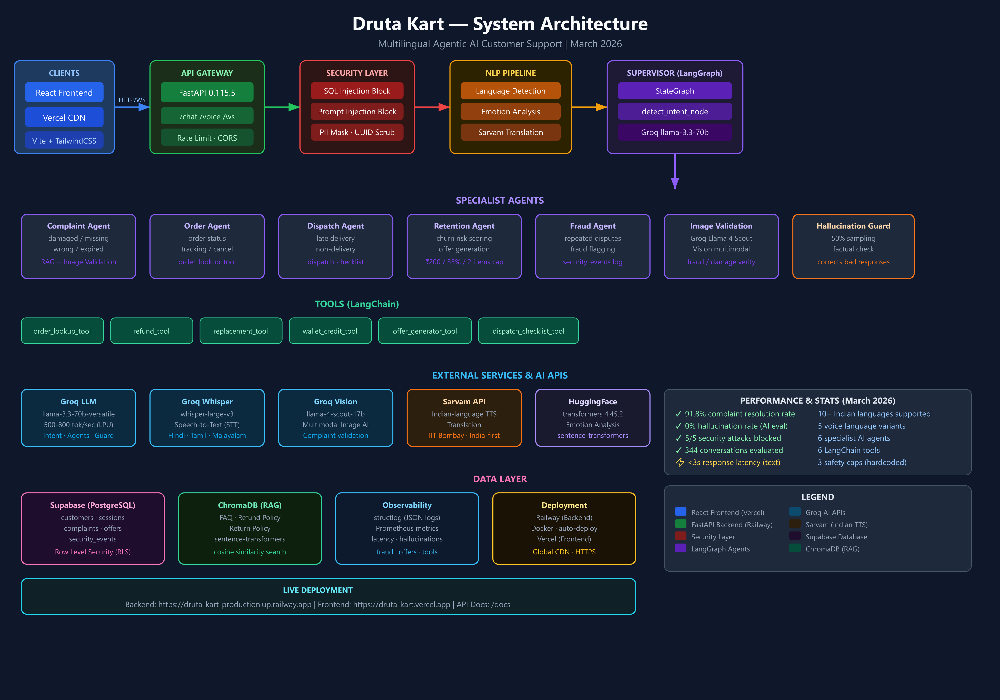
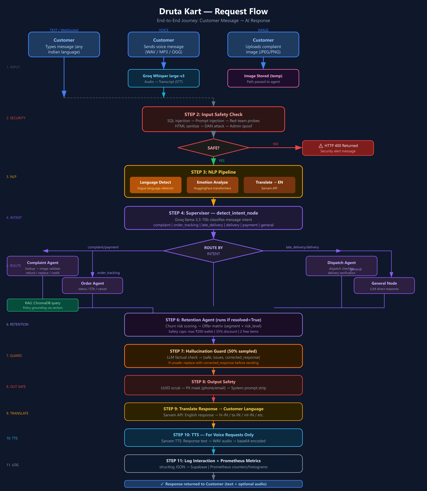

<div align="center">



# Druta Kart — Multilingual Agentic AI Customer Support

> **"Druta" (द्रुत) = Swift in Sanskrit** — Real-time AI support for quick commerce India

[](https://druta-kart-production.up.railway.app)
[](https://druta-kart.vercel.app)
[](https://python.org)
[](https://fastapi.tiangolo.com)
[](https://langchain-ai.github.io/langgraph/)
[](https://groq.com)

</div>

---

## Live Deployment

| Service | URL |
|---|---|
| **Backend API** | https://druta-kart-production.up.railway.app |
| **Frontend** | https://druta-kart.vercel.app |
| **API Docs (Swagger)** | https://druta-kart-production.up.railway.app/docs |
| **Health Check** | https://druta-kart-production.up.railway.app/health |
| **Metrics** | https://druta-kart-production.up.railway.app/metrics |

> ⚠️ Hosted demo currently offline. To clone and run locally, minimum required keys: `GROQ_API_KEY` · `SARVAM_API_KEY` · `SUPABASE_URL` · `SUPABASE_SERVICE_ROLE_KEY`. For a live walkthrough contact [jishnuparameswaran@gmail.com](mailto:jishnuparameswaran@gmail.com)

---

## Video Demo

<div align="center">

[](https://youtu.be/PtPVqp-qtHA)

**[Watch Full Demo on YouTube](https://youtu.be/PtPVqp-qtHA)** — Live walkthrough of multilingual voice, complaint handling, image validation, and agent routing in action.

</div>

---

## What Is Druta Kart?

Druta Kart is an **agentic AI customer support backend** for quick commerce platforms in India (think Blinkit, Zepto, Swiggy Instamart). It solves a real problem: most chatbots are English-only, text-only, and hallucinate policies — failing the majority of India.

**Druta Kart can:**
- Understand complaints in **10+ Indian languages** (Hindi, Tamil, Malayalam, Telugu, Kannada, Bengali, Hinglish, and more)
- Accept **voice messages** and respond with **voice audio** in the customer's language
- **Validate complaint images** using multimodal AI (Groq Llama 4 Scout)
- Route messages to **specialist AI agents** via a LangGraph StateGraph
- **Prevent hallucination** with a post-generation factuality guard
- Generate **personalized retention offers** with hardcoded financial safety caps
- **Block prompt injection, SQL injection, DAN attacks, and red-team probes**

---

## Architecture

<div align="center">



</div>

```
Customer (text / voice / image)
    │
    ▼
FastAPI  ─── Rate Limit (slowapi) ─── CORS
    │
    ▼
Security Layer  ─── SQL injection / Prompt injection / Red-team blocks
    │
    ▼
NLP Pipeline  ─── Language detect → Emotion analyze → Translate → English
    │
    ▼
LangGraph Supervisor  ─── detect_intent_node (Groq llama-3.3-70b)
    │
    ├── complaint  → Complaint Agent → Image Validation → RAG → Tools
    │                    └── Retention Agent → Offer Engine
    ├── order       → Order Agent → order_lookup_tool
    ├── dispatch    → Dispatch Agent → dispatch_checklist_tool
    └── general     → General Node (LLM direct)
    │
    ▼
respond_node  ─── Hallucination Guard (50% sampled)
    │
    ▼
Output Safety  ─── UUID scrub → PII mask → System prompt strip
    │
    ▼
Translate back → Customer language (Sarvam API)
    │
    ▼  [voice only]
TTS  ─── Sarvam API → WAV audio → base64
    │
    ▼
Log + Metrics  ─── structlog → Supabase + Prometheus
    │
    ▼
Response to Customer
```

---

## Request Flow

<div align="center">



</div>

---

## Features

### Endpoints
| Method | Path | Description |
|---|---|---|
| POST | `/chat` | Text chat — full NLP + agent pipeline |
| POST | `/voice` | Voice chat — STT → pipeline → TTS |
| POST | `/upload-image` | Upload complaint image (3/session max) |
| WS | `/ws/{session_id}` | WebSocket real-time chat |
| GET | `/health` | Health check |
| GET | `/metrics` | Prometheus metrics |
| GET | `/docs` | Swagger UI |

### Specialist Agents
| Agent | Handles |
|---|---|
| `complaint_agent` | Damaged / missing / wrong / expired items, payment issues |
| `order_agent` | Order status, ETA, cancellation |
| `dispatch_agent` | Late delivery, non-delivery, wrong address |
| `fraud_escalation_agent` | Repeated disputes, fraud flagging |
| `retention_agent` | Churn risk scoring, personalized offer generation |
| `image_validation_agent` | Two-layer image fraud detection: EXIF metadata scan (Layer 1) + Groq Vision LLM (Layer 2). Detects AI-generated (Midjourney, DALL-E, Stable Diffusion) and manipulated images. Outcomes: real_damage → resolve, misidentification → educate, ai_generated → request live photo, suspicious → escalate on refusal |
| `hallucination_guard` | Post-generation factuality check (50% sampled) |

### LangChain Tools
`order_lookup_tool` · `refund_tool` · `replacement_tool` · `wallet_credit_tool` · `offer_generator_tool` · `dispatch_checklist_tool`

### Safety Caps (hardcoded in `config.py` — LLM cannot override)
| Cap | Value |
|---|---|
| Max wallet credit | ₹200 |
| Max discount | 35% |
| Max free items per complaint | 2 |

---

## Tech Stack

| Layer | Technology | Why |
|---|---|---|
| Language | Python 3.11 | Best AI/ML ecosystem; 10-60% faster than 3.10 |
| API | FastAPI 0.115.5 | Async, auto OpenAPI docs, WebSocket, Pydantic |
| Agent Orchestration | LangGraph 0.2.53 | Stateful StateGraph, conditional routing |
| LLM Inference | Groq (llama-3.3-70b) | LPU hardware — 500-800 tok/sec, lowest latency |
| STT | Groq Whisper large-v3 | Best accuracy, runs on Groq LPU (no GPU needed) |
| Vision | Groq Llama 4 Scout | Multimodal image analysis for complaint validation |
| TTS + Translation | Sarvam API | Indian-company, best Indian-language TTS quality |
| Language Detection | Groq llama-3.3-70b-versatile | LLM-based — handles Hinglish, Kanglish, Manglish that rule-based detectors fail on |
| Emotion Analysis | HuggingFace transformers | Local CPU model, no API cost |
| Embeddings | sentence-transformers 3.3.1 | Open-source, CPU-efficient, multilingual |
| Vector DB | Supabase pgvector | Same DB as Postgres — no extra infra; keyword search fallback |
| Database | Supabase (PostgreSQL) | RLS, pgvector, real-time, free tier |
| Config | pydantic-settings 2.6.1 | Type-safe .env parsing, single source of truth |
| Rate Limiting | slowapi 0.1.9 | 30 req/min per IP, API cost protection |
| Logging | structlog 24.4.0 | JSON structured logs, machine-parseable |
| Metrics | prometheus-client 0.21.1 | Industry-standard, /metrics endpoint |
| Frontend | React 18 + Vite 6 + TailwindCSS 3 | Fast build, utility-first CSS |
| Backend Deploy | Railway | Docker-native, GitHub CI/CD |
| Frontend Deploy | Vercel | Zero-config React/Vite, global CDN |

---

## Evaluation Results (March 2026)

| Metric | Result |
|---|---|
| Total conversations evaluated | **344** (339 text + 5 voice) |
| Complaint resolution rate | **91.8%** |
| Hallucination rate | **0%** |
| Security attacks blocked | **5/5 (100%)** |
| Languages tested | English, Hindi, Malayalam, Tamil, Hinglish |
| Voice variants tested | 5 |

Security attacks tested: prompt injection · SQL injection · DAN attack · red-team probe · admin spoofing — **all blocked**.

---

## Project Structure

```
Druta-Kart/
├── backend/
│   ├── main.py                  # FastAPI app, all endpoints
│   ├── config.py                # Settings (pydantic-settings)
│   ├── agents/
│   │   ├── supervisor.py        # LangGraph StateGraph
│   │   ├── complaint_agent.py
│   │   ├── order_agent.py
│   │   ├── dispatch_agent.py
│   │   ├── fraud_escalation_agent.py
│   │   ├── retention_agent.py
│   │   ├── image_validation_agent.py
│   │   └── hallucination_guard.py
│   ├── tools/                   # LangChain tools
│   ├── nlp/                     # Language detect, emotion, translation
│   ├── multimodal/              # STT (Whisper), TTS (Sarvam), Vision
│   ├── rag/                     # ChromaDB, embeddings, ingest
│   ├── db/                      # Supabase client, models, repos
│   ├── retention/               # Churn scorer, offer engine
│   ├── security/                # Safety layer (input + output)
│   ├── observability/           # structlog, Prometheus metrics
│   ├── prompts/                 # Versioned prompt registry
│   └── tests/
│       ├── ai_to_ai_eval.py     # AI-to-AI evaluation framework
│       └── voice_eval.py        # Voice pipeline evaluation
├── frontend/                    # React + Vite + TailwindCSS
├── Presentation/                # Docs, architecture diagram, flowchart, slides
│   ├── DRUTAKART.png            # Hero banner
│   ├── architecture_diagram.png # System architecture
│   ├── flowchart.png            # Request flow diagram
│   ├── Druta_Kart Documentation.pdf  # Full technical documentation
│   └── presentation.html        # Slide deck (open in browser)
├── docker-compose.yml
├── railway.toml
└── .env.example
```

---

## Setup — Local Development

### Prerequisites
- Python 3.11
- Node.js 18+
- API keys: Groq, Sarvam, Supabase

### Backend

```bash
# Clone
git clone https://github.com/JishnuParameswaran/Druta-Kart.git
cd druta-kart

# Environment
cp .env.example .env
# Fill in: GROQ_API_KEY, SARVAM_API_KEY, SUPABASE_URL, SUPABASE_SERVICE_ROLE_KEY

# Install dependencies
cd backend
pip install -r requirements.txt

# Seed the RAG knowledge base
python -m rag.ingest

# Run
uvicorn main:app --host 0.0.0.0 --port 8000 --reload
```

### Frontend

```bash
cd frontend
npm install
npm run dev
# Opens at http://localhost:5173
```

### Docker (full stack)

```bash
docker compose up --build
```

---

## Environment Variables

| Variable | Required | Description |
|---|---|---|
| `GROQ_API_KEY` | ✅ | Groq API key (LLM + Whisper + Vision) |
| `SARVAM_API_KEY` | ✅ | Sarvam API key (TTS + translation) |
| `SUPABASE_URL` | ✅ | Supabase project URL |
| `SUPABASE_SERVICE_ROLE_KEY` | ✅ | Service role key (NOT anon key — RLS is enabled) |
| `CORS_ORIGINS` | ✅ prod | Comma-separated allowed origins |
| `GROQ_TEXT_MODEL` | ❌ | Default: `llama-3.3-70b-versatile` |
| `GROQ_VISION_MODEL` | ❌ | Default: `meta-llama/llama-4-scout-17b-16e-instruct` |
| `GROQ_WHISPER_MODEL` | ❌ | Default: `whisper-large-v3` |
| `HALLUCINATION_CHECK_SAMPLING_RATE` | ❌ | Default: `0.5` |
| `MAX_WALLET_CREDIT_INR` | ❌ | Default: `200` (safety cap) |
| `MAX_DISCOUNT_PERCENT` | ❌ | Default: `35` (safety cap) |
| `MAX_FREE_ITEMS_PER_COMPLAINT` | ❌ | Default: `2` (safety cap) |

> **Always use `SUPABASE_SERVICE_ROLE_KEY`.** The anon key has RLS restrictions and will silently fail all reads/writes.

---

## Running Tests & Evaluations

```bash
# Unit tests
cd backend
pytest tests/

# AI-to-AI evaluation — add 10 new conversations
python tests/ai_to_ai_eval.py --new 10

# AI-to-AI evaluation — report only (no new runs)
python tests/ai_to_ai_eval.py --new 0

# Targeted language test
python tests/ai_to_ai_eval.py --new 5 --language malayalam

# Voice evaluation
python tests/voice_eval.py

# Voice evaluation — report only
python tests/voice_eval.py --report
```

---

## Deployment

### Backend → Railway
1. Connect GitHub repo to Railway
2. Set build context: `backend/`, Dockerfile: `backend/Dockerfile`
3. Add all environment variables in Railway dashboard
4. Add Vercel frontend URL to `CORS_ORIGINS`

### Frontend → Vercel
1. Connect GitHub repo to Vercel
2. Set root directory: `frontend/`
3. Vercel auto-detects Vite — zero config needed

### Database → Supabase
1. Run migration: `supabase/migrations/001_pgvector.sql` in Supabase SQL editor
2. After Railway deploy: `cd backend && python -m rag.ingest` to seed documents

---

## Key Design Decisions

**Why multi-agent instead of one LLM call?**
Each specialist agent has a focused prompt, focused tools, and explicit state. One monolithic agent suffers from context bloat, is hard to debug, and mixes up complaint handling with order tracking.

**Why are safety caps hardcoded in `config.py`?**
LLMs can be prompted into offering 100% discounts. Python-level clamps in the offer engine cannot be overridden by any LLM output — ever.

**Why Groq instead of OpenAI?**
Groq's LPU delivers 10-20x faster inference than GPU-based cloud. Customer support needs sub-second latency. Groq + Llama 3.3 70B costs a fraction of GPT-4 with comparable quality.

**Why Sarvam for TTS?**
Google TTS and Amazon Polly produce robotic audio for regional Indian languages. Sarvam was purpose-built for Indian language TTS by IIT Bombay researchers and produces natural, accent-accurate speech.

**Why two-layer image fraud detection?**
Quick commerce platforms face a real fraud pattern: customers upload AI-generated images of damaged products to claim fraudulent refunds. A single check is not enough — EXIF metadata alone misses images that have had metadata stripped, and Vision LLM alone can be fooled by high-quality AI art. Combining both layers (EXIF software tag scan + Groq Vision forensic analysis) catches fraud that either layer alone would miss. When a fake image is detected, the system does not accuse the customer — it politely requests a live camera photo, which cannot be substituted with an AI-generated image.

**Why AI-to-AI evaluation?**
Human annotation is slow, expensive, and hard to scale across 10+ languages. Using Groq as both simulator and judge allows testing 344 conversations in hours with consistent, reproducible scoring.

---

## Documentation & Presentation

| Asset | Link |
|---|---|
| **Full Technical Documentation (PDF)** | [Druta_Kart Documentation.pdf](Presentation/Druta_Kart%20Documentation.pdf) |
| **Architecture Diagram** | [architecture_diagram.png](Presentation/architecture_diagram.png) |
| **Request Flowchart** | [flowchart.png](Presentation/flowchart.png) |
| **Slide Deck (HTML)** | [presentation.html](Presentation/presentation.html) |
| **Video Demo** | [YouTube](https://youtu.be/PtPVqp-qtHA) |
| **Architecture & Deep-Dive (49 min)** | [YouTube](https://youtu.be/tL3gtzmNNLk) |

---

## License

Source Available License

---

## Contact

**Jishnu Parameswaran.P.K** — Gen AI Engineer

[](https://www.linkedin.com/in/jishnu-parameswaran-76962725b)
[](mailto:jishnuparameswaran@gmail.com)

---

<div align="center">

*Built with ❤️ for Bharat — Groq · Sarvam · LangGraph · FastAPI · Supabase · Railway · Vercel*

</div>
